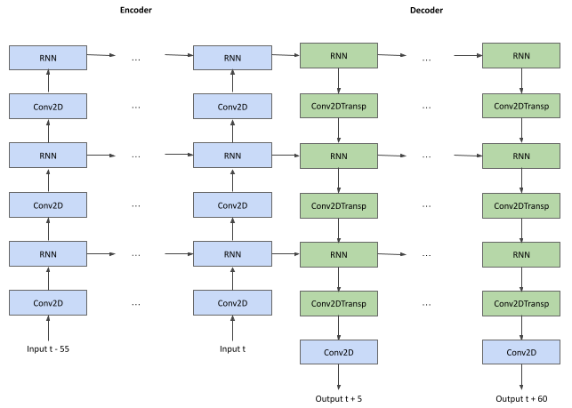
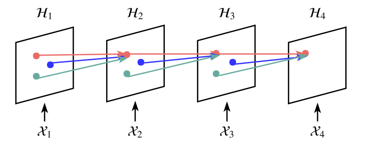
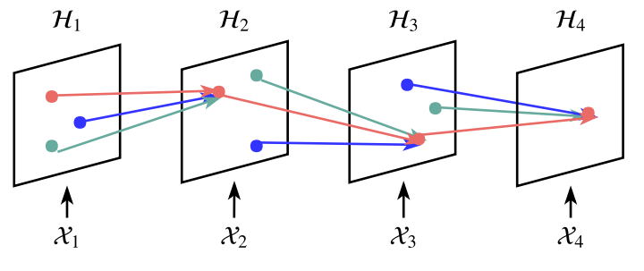
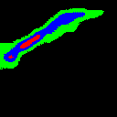
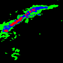
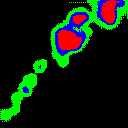
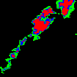

# Precipitation Nowcasting

Precipitation nowcasting is the high-resolution forecasting of precipitation up to two hours. Traditional numerical weather prediction models, are not always accurate enough to provide reliable forecasts for periods of less than two hours or are too complex to operate at high resolution with real-time constraints. Various methods are currently available to address this problem, including image block matching, precipitation cell matching and methods based on optical flow. The emergence of machine learning technologies has led researchers to investigate the application of Deep Learning methods to this field. 

This research project is part of the Master 2 IMA program at Sorbonne University.
The aim was to establish a state of the art of current deep learning methods for the Precipitation Nowcasting problem, to implement methods on data from the Meteo-Net dataset and to compare its results with those obtained following work undertaken in the LIP6 laboratory with a U-Net model [[1]](#ref1).

1. [Models](#1-models)
2. [Results](#2-results)
    1. [Quantitative results](#2a-quantitative-results)
    2. [Examples of predictions](#2b-examples-of-predictions)
3. [Code](#3-code)
    1. [Train a model](#1-to-train-a-model)
    2. [Evaluate a model](#2-to-evaluate-a-model) 

## 1. Models

We have studied whether the use of a recurrent model brings added value compared to the U-Net model. The ConvGRU and TrajGRU models were implemented. 

#### ConvGRU

A ConvGRU model is a neural network architecture that combines the concepts of Convolutional Neural Networks (CNNs) and Gated Recurrent Units (GRUs). The ConvGRU model blends the strengths of both architectures to handle spatiotemporal data efficiently.

The architecture of the model is as follows :


RNN blocks correspond to the GRU cell, while Conv2D and Conv2DTranspose operations act as upsampler and downsampler with stride. This helps analysing at different resolution levels and capture a global representation for the deepest layers, which can help guide the update of shallower layers. 

#### TrajGRU

The architecture of this neural network is the same as the previous Conv-GRU neural network shown in the figure above. Only the type of recurrent cell used changes. The TrajGRU recurrent cell is an extension of the ConvGRU cell, in which recurrent connections between cache states are learned automatically. 

<div style="display:flex; justify-content:center;">
    <figure>
        
        <figcaption style="text-align: center;"> In traditional RNN, recurrent connections are fixed over time.  </figcaption>
    </figure>
</div>
<div style="display:flex; justify-content:center;">
    <figure>
        
    <figcaption style="text-align: center;"> In TrajGRU, recurrent connections are dynamically determined </figcaption>
    </figure>
</div>

Figures are from [[2]](#ref2).

Connections are calculated dynamically in two steps. Firstly, a small neural network within the TrajGRU cell is used to estimate the $U$ and $V$ components of the optic flow at $t$. Then, the hidden state $H$ at $t$ is updated with the positions pointed out by $U$ and $V$ from $H$ at $t-1$.

## 2. Results
### a. Quantitative results 

The neural networks take as input the accumulation of one hour's rainfall data by the concatenation of 12 successive images (radar data acquired every 5 minutes).
We have also studied the joint use of rainfall data with wind data in two components, U and V, as was done in [[1]](#ref1).

<div style="overflow-x:auto;">
  <table style="width:100%;">
    <thead>
      <tr>
        <th style="width:2cm;">Time</th>
        <th>Model</th>
        <th colspan="3">F1-Score</th>
        <th colspan="3">TS-Score</th>
        <th colspan="3">Bias-Score</th>
      </tr>
      <tr>
        <th></th>
        <th></th>
        <th>Class 1</th>
        <th>Class 2</th>
        <th>Class 3</th>
        <th>Class 1</th>
        <th>Class 2</th>
        <th>Class 3</th>
        <th>Class 1</th>
        <th>Class 2</th>
        <th>Class 3</th>
      </tr>
    </thead>
    <tbody>
      <tr>
        <td rowspan="6"><b>30 min</td>
        <td><b>Persistence</td>
        <td>0.602</td>
        <td>0.438</td>
        <td>0.264</td>
        <td>0.43</td>
        <td>0.28</td>
        <td>0.152</td>
        <td><b>0.993</td>
        <td><b>0.999</td>
        <td><b>1.006</td>
      </tr>
      <tr>
        <td><b>ConvGRU</td>
        <td>0.689</td>
        <td>0.592</td>
        <td>0.425</td>
        <td>0.525</td>
        <td>0.42</td>
        <td>0.27</td>
        <td>1.104</td>
        <td>1.088</td>
        <td>0.755</td>
      </tr>
      <tr>
        <td><b>TrajGRU</td>
        <td>0.685</td>
        <td><b>0.604</td>
        <td>0.461</td>
        <td>0.521</td>
        <td><b>0.433</td>
        <td>0.3</td>
        <td>1.129</td>
        <td>1.196</td>
        <td>0.904</td>
      </tr>
      <tr>
        <td><b>ConvGRU_Wind</td>
        <td>0.674</td>
        <td>0.595</td>
        <td>0.476</td>
        <td>0.508</td>
        <td>0.424</td>
        <td>0.313</td>
        <td>1.224</td>
        <td>1.342</td>
        <td>1.211</td>
      </tr>
      <tr>
        <td><b>TrajGRU_Wind</td>
        <td>0.667</td>
        <td>0.598</td>
        <td><b>0.48</td>
        <td>0.501</td>
        <td>0.426</td>
        <td><b>0.316</td>
        <td>1.297</td>
        <td>1.245</td>
        <td>1.021</td>
      </tr>
      <tr>
        <td><b>UNet_Wind</td>
        <td><b>0.724</td>
        <td>0.581</td>
        <td>0.43</td>
        <td><b>0.567</td>
        <td>0.41</td>
        <td>0.274</td>
        <td>0.907</td>
        <td>0.817</td>
        <td>0.699</td>
      </tr>
      <tr>
        <td rowspan="6"><b>60 min</td>
        <td><b>Persistence</td>
        <td>0.523</td>
        <td>0.338</td>
        <td>0.166</td>
        <td>0.354</td>
        <td>0.203</td>
        <td>0.09</td>
        <td><b>0.998</td>
        <td><b>0.997</td>
        <td><b>0.997</td>
      </tr>
      <tr>
        <td><b>ConvGRU</td>
        <td>0.596</td>
        <td>0.456</td>
        <td>0.171</td>
        <td>0.425</td>
        <td>0.296</td>
        <td>0.093</td>
        <td>1.017</td>
        <td>0.818</td>
        <td>0.293</td>
      </tr>
      <tr>
        <td><b>TrajGRU</td>
        <td><b>0.598</td>
        <td>0.493</td>
        <td>0.274</td>
        <td><b>0.426</td>
        <td>0.327</td>
        <td>0.159</td>
        <td>1.215</td>
        <td>1.099</td>
        <td>0.547</td>
      </tr>
      <tr>
        <td><b>ConvGRU_Wind</td>
        <td>0.581</td>
        <td>0.485</td>
        <td>0.311</td>
        <td>0.41</td>
        <td>0.32</td>
        <td>0.184</td>
        <td>1.468</td>
        <td>1.592</td>
        <td>1.281</td>
      </tr>
      <tr>
        <td><b>TrajGRU_Wind</td>
        <td>0.578</td>
        <td><b>0.502</td>
        <td><b>0.319</td>
        <td>0.407</td>
        <td><b>0.335</td>
        <td><b>0.19</td>
        <td>1.53</td>
        <td>1.303</td>
        <td>0.819</td>
      </tr>
      <tr>
        <td><b>UNet_Wind</td>
        <td>0.569</td>
        <td>0.391</td>
        <td>0.204</td>
        <td>0.397</td>
        <td>0.243</td>
        <td>0.113</td>
        <td>0.848</td>
        <td>0.78</td>
        <td>0.627</td>
      </tr>
    </tbody>
  </table>
</div>

Metrics are defined at the end of this README.md.

For a pixel $p_{i,j}$ in the image, the classes are the following:
- CLass 1 if $ 0.1 $ mm/h $ \le p_{i, j} < 1 $ mm/h
- Class 2 if $ 1 $ mm/h $ \le p_{i, j} < 2.5 $ mm/h
- Class 3 if $ 2.5 $ mm/h $ \le p_{i, j} $

Recurrent neural networks perform better than U-Net for high precipitation rates, which tends to generate blurry predictions but scores well at low precipitation rates. 
Without wind data, TrajGRU improves on ConvGRU, especially for classes 2 and 3. Estimating the optical flow seems to help understand the context and improve prediction. With wind data, these two neural networks have similar results, and the optical flow estimation module is no longer necessary, since the input wind data already provides this information. 

### b. Examples of predictions

<div style="display:flex; justify-content:center;">
    <figure>
        
        
    </figure>
</div>

<div style="display:flex; justify-content:center;">
    <figure>
        
        
    </figure>
</div>

On the left, the prediction made by the TrajGRU model, on the right, the ground truth.

A few points for improvement : 
- Predicted cell boundaries are usually smoothed.
- Fails to localize small but heavy rain events.
- We are limited by windows size.

These are some of the arguments in favor of using a GAN as presented in [[3]](#ref3).


## 3. Code

### a. Train a model

To train a model you can use the file `main.py`. The command `python3 main.py --help` helps you look at the different parameters to specify. 

Example : 

```
python3 main.py --epochs 50 --batch_size 4 --input_length 12 --output_length 12 --network TrajGRU
```

Be careful, you need to change the folder path of the data in `main.py`.

The mean and variance parameters for the wind that appeared in `dataset.py` have been computed from the file `compute_wind_statistics.py`.

### b. Evaluate a model. 

To evaluate the model you will use the file `eval_model.py`. You can use the command `python3 main.py --help` to look at the different parameters to specify. 

You need to provide the location to the `.pth` file that contains the network. 
You may also need to change the folder path of the data. 


## 4. References 

1. <a id="ref1"> [Vincent Bouget et al. “Fusion of Rain Radar Images and Wind Forecasts in a Deep Learning Model Applied to Rain Nowcasting”](https://hal.sorbonne-universite.fr/hal-03112093), In : Remote Sensing 13.2, p. 246.

2. <a id="ref2"> [Xingjian Shi et al. Deep Learning for Precipitation Nowcasting: A Benchmark and A New Model](https://arxiv.org/abs/1706.03458), 2017.

3. <a id="ref3"> [Suman V. Ravuri et al. “Skilful precipitation nowcasting using deep generative models of radar”](https://www.nature.com/articles/s41586-021-03854-z), In : Nature 597 (2021), p. 672-677.


## 5. Metrics

### F1-Score
$$
F_1=2 \times \frac{P P V \times T P R}{P P V+T P R}=\frac{2 T P}{2 T P+F P+F N}
$$

### Threat Score or critical success index
$$
TS=\frac{T P}{T P + F N + F P}
$$

### Bias
$$
BIAS = \frac{T P + F P}{T P + F N}
$$